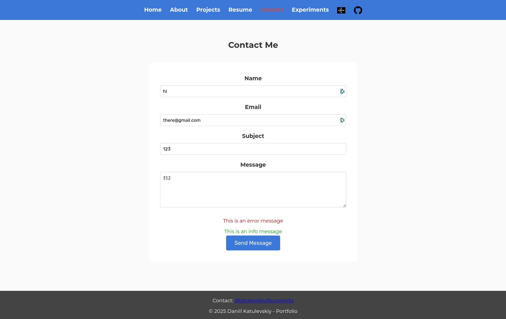

# HW4 Part 1

## POST REQUEST

POST /post HTTP/1.1
Host: httpbin.org
User-Agent: Mozilla/5.0 (X11; Linux x86_64; rv:135.0) Gecko/20100101 Firefox/135.0
Date: Wed, 26 Feb 2025 02:41:19 GMT
Content-Type: application/x-www-form-urlencoded
Content-Length: 134

name=Daniil+Katulevskiy&email=daniil%40example.com&message=This+is+a+test%21&possible_bot=false

## LINKS:

https://katul-portfolio2.netlify.app/

https://github.com/katulevskiy/cse134-hw4
